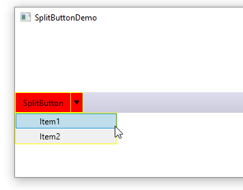

# WPF Split Button
This is an example of combobox like button. The button can have a nested menu, although provided example has a single level menu. The style can be customized, the provided example adopted for toolbar use.
